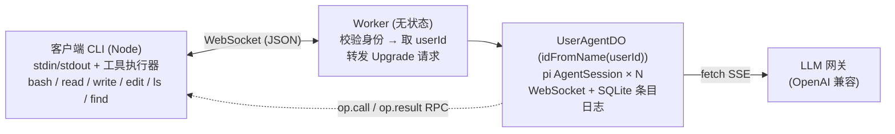
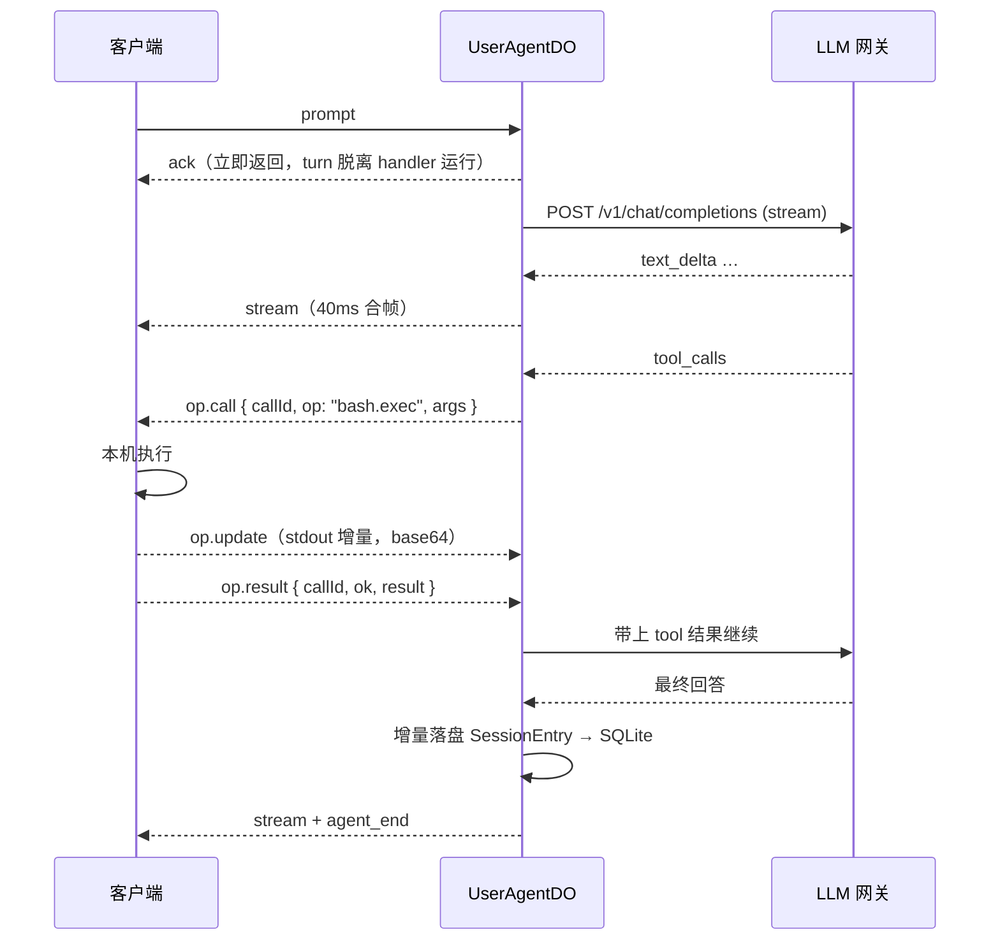

# widget-agent server

把 [pi coding agent](https://github.com/earendil-works/pi) 作为 SDK 跑在 Cloudflare Workers + Durable Objects 上，
工具（bash / 文件读写）在客户端本机执行，服务端只负责编排、状态与扇出。

- 一个 user 一个 Durable Object，按请求中的 user-id 路由
- 会话持久化在 DO 的 SQLite 里，可跨 DO 驱逐 / 重新部署恢复
- 客户端通过 WebSocket 长连接接收吐字与工具调用事件，并在本地执行工具

---

## 目录

- [一、为什么这么切（第一性原理）](#一为什么这么切第一性原理)
- [二、架构](#二架构)
- [三、目录结构](#三目录结构)
- [四、关键设计决策](#四关键设计决策)
- [五、通信协议](#五通信协议)
- [六、本地运行与测试](#六本地运行与测试)
- [七、部署](#七部署)
- [八、踩过的坑（重要）](#八踩过的坑重要)
- [九、已知缺口与后续计划](#九已知缺口与后续计划)

---

## 一、为什么这么切（第一性原理）

Agent 的本质是一个循环：`组装 context → 调 LLM 流 → 解析 tool_use → 执行 tool → 追加结果 → 重复`。
把循环里的每个原语按"它真正依赖什么"归类，切分线就自己浮现了：

| 原语 | 真实依赖 | 能否落在 Workers |
| --- | --- | --- |
| 组装 context / 系统提示词 / 上下文压缩 | 纯计算 | ✅ |
| 调 LLM 流 | `fetch` + SSE 解析 | ✅ pi-ai 底层走全局 fetch |
| 会话历史 | 单写者的追加日志 | ✅ DO 天然单线程 = 单写者，SQLite 10 GB/DO |
| tool 执行 | 进程 / 文件系统 | ❌ 必须离开 Workers |
| 流式推送 + 双向通信 | 长连接扇出 | ✅ DO WebSocket |

结论：**Cloudflare 上只跑「编排 + 状态 + 扇出」，工具下沉到客户端**。
这不是对平台限制的妥协，而是正确的切分线 —— Claude Code / Codex / Cursor / MCP 都是这个形状。

对应的行业最佳实践：

1. **云端大脑 + 本地手脚**：tool 调用建模成带 `callId` 的 request/response RPC，必须自带超时、取消、流式 stdout。
2. **Durable agent = append-only 事件日志**：不存"当前状态快照"，存事件流，状态由重放得出。
3. **恢复靠游标**：客户端重连时带 `sinceSeq`，服务端补发之后的条目。
4. **合帧**：不要一个 token 一个 WS 帧，Cloudflare 明确建议 batching，否则单 DO 吞吐被上下文切换吃掉。

---

## 二、架构



### 一次 turn 的时序



关键点：

- `webSocketMessage` **先 ack、再脱离运行 turn**。若在 handler 里 await 整个 turn，
  后续的 `op.result` 帧可能被排队，直接死锁。
- turn 运行期间用 `setInterval` 保活。仅有一个 pending promise 并不能阻止 DO 休眠，但活动的 timer 可以。
- 每条入站 WS 消息会**重置 DO 的 30 秒 CPU 预算**，所以工具往返频繁反而是安全的；
  另外在 `wrangler.jsonc` 里把 `limits.cpu_ms` 提到 5 分钟。

---

## 三、目录结构

```
server/
├── package.json                    npm workspaces 根
├── tsconfig.base.json
└── packages/
    ├── protocol/                   客户端与服务端唯一的契约（无运行时依赖）
    │   └── src/index.ts            消息联合类型 + RemoteOpMap + VIRTUAL_ROOT
    ├── server/                     Cloudflare Worker
    │   ├── wrangler.jsonc
    │   ├── .dev.vars.example
    │   └── src/
    │       ├── typebox-setup.ts    必须最先 import：关闭 TypeBox JIT
    │       ├── index.ts            Worker 入口：鉴权 + 路由到 DO
    │       ├── env.ts              环境变量类型与默认值
    │       ├── user-id.ts          身份解析（当前是原型桩）
    │       ├── do/
    │       │   ├── user-agent-do.ts  Durable Object 主体
    │       │   ├── session-store.ts  SQLite schema 与条目日志
    │       │   ├── session-runner.ts 单个 AgentSession 的生命周期 + 事件映射
    │       │   ├── op-rpc.ts         远程工具 RPC（超时/取消/流式）
    │       │   └── outbox.ts         事件合帧
    │       └── agent/
    │           ├── model.ts          ModelRuntime + 自定义 provider
    │           ├── remote-ops.ts     pi *Operations 的远程实现
    │           └── session-factory.ts 创建会话 + 从条目日志恢复消息/模型/思考等级
    └── client/                     无 TUI 的 Node CLI
        ├── .env.example
        └── src/
            ├── index.ts            stdin/stdout REPL + 事件渲染
            └── local-ops.ts        本机工具执行 + 路径映射与越界校验
```

---

## 四、关键设计决策

| 关注点 | 决策 | 依据 |
| --- | --- | --- |
| 会话存储 | `SessionManager.inMemory()` + 增量把 pi 的 `SessionEntry` 落进 DO SQLite | CF 的 `node:fs` 是内存 VFS，且 `/tmp` **按请求隔离**，文件版 SessionManager 不可用 |
| 会话恢复 | 读回条目 → 线性重链 `parentId` → `buildSessionContext()` → 回填消息、模型与思考等级 | v1 没有分支/fork，线性重链是精确的；模型若已下架则回退到默认值 |
| 落盘触发 | 持有自己的 `SessionManager` 引用，在 `message_end` / `turn_end` / `tool_execution_end` / `compaction_end` 后 drain `getEntries()` | pi 的 `entry_appended` 事件**只针对扩展自定义条目**，不是通用持久化钩子 |
| 工具 | 不重写工具，而是实现 pi 自己留的 `BashOperations` / `ReadOperations` / `EditOperations` / `WriteOperations` / `LsOperations` / `FindOperations` | pi 源码注释原文："Override these to delegate ... to remote systems (for example SSH)"；这样参数校验、截断、diff、prompt 文案全部保留，只换 IO 层 |
| 工具注册 | `createAgentSession({ customTools, tools })`，同名 customTools 在注册表中覆盖内置工具 | `_refreshToolRegistry` 中 custom 在 builtin 之后 set |
| 路径 | 服务端一律用虚拟根 `/workspace` 解析，客户端映射到真实 cwd 并校验越界 | Workers 的 `node:path` 只有 POSIX 语义，直接传 `D:\repo` 会解析错 |
| 模型接入 | `ModelRuntime.create({ credentials: InMemoryCredentialStore, modelsPath: null })` + `registerProvider(<当前 provider>, { api: "openai-completions", ... })` | 全内存，密钥留在 Workers Secret |
| 多 provider | 两家网关（`gateway` = Opus/GPT，`deepseek`）都是 OpenAI 兼容，catalog 各自一份，`LLM_PROVIDER` 选定**唯一**生效的一家，只注册它 | 两家都注册的话，没配第二家的 key 会变成启动硬失败；而实际上同一部署只用一家 |
| 扩展 | 关闭（`noExtensions: true`）。将来用 `DefaultResourceLoader({ extensionFactories })` 编译期内联 | jiti 动态加载 TS 在 Workers 不可用（无 eval / 无动态 import） |
| 协议 | 自建 JSON over WS，词表对齐 pi RPC mode | `@earendil-works/pi-client` + `pi-protocol` 是 CBOR、官方标注 Experimental，且不支持客户端执行工具 |
| 并发 | 单 DO 内多 session，同时 streaming 的 session 数上限由 `MAX_CONCURRENT_TURNS` 控制（默认 3） | |

### 模型 provider（Opus / DeepSeek）

同一部署同一时刻只跑**一家**上游，由 `LLM_PROVIDER` 决定；切换 = 改配置 + 重启/重新部署，不是每会话可选项。

| provider | baseUrl 变量 | key 变量 | 默认模型变量 | 可用模型 |
| --- | --- | --- | --- | --- |
| `gateway`（默认） | `LLM_BASE_URL` | `LLM_API_KEY` | `DEFAULT_MODEL` | `claude-opus-4.8/4.7/4.5`、`claude-sonnet-4.5`、`gpt-5.6-sol`、`gpt-5.5` |
| `deepseek` | `DEEPSEEK_BASE_URL` | `DEEPSEEK_API_KEY` | `DEEPSEEK_DEFAULT_MODEL` | `deepseek-v4-pro`、`deepseek-v4-flash`、`deepseek-v4-flash-vision-exp` |

定义都在 [`packages/server/src/agent/model.ts`](packages/server/src/agent/model.ts) 的 `PROVIDERS` 数组里，加第三家只需要再追加一项。

`createModelRuntime` **只注册当前选中的那一家**。两家都注册的话，没配 DeepSeek key 的部署会在启动时就炸，而那个 key 其实压根用不到。

两家的 `compat` 不同（都是实测出来的，不是抄默认值）：

| compat 项 | gateway | deepseek | 原因 |
| --- | --- | --- | --- |
| `supportsDeveloperRole` | `false` | `false` | gateway 静默丢弃 `role: "developer"`；DeepSeek 直接 400：``unknown variant `developer` `` |
| `thinkingFormat` | 默认 `openai` | `deepseek` | DeepSeek 接受 `thinking: { type }`，推理内容走 `reasoning_content`（pi 的 `openai-completions` 已原生识别并转成 `thinking_delta`） |
| `maxTokensField` | 自动探测 | `max_tokens` | DeepSeek 两个字段都收，钉死避免 URL 探测猜错 |

只有 `deepseek-v4-flash-vision-exp` 声明 `input: ["text", "image"]`，另外两个是纯文本。

**切换 provider 对既有会话的影响**：`resolveRestoredModel` 发现持久化的模型不属于当前 provider 时，会回退到新 provider 的默认模型，而不是报错。也就是说切完 `LLM_PROVIDER`，老会话仍然打得开、历史仍然完整，但会**迁移到新家的默认模型**上。这跟下面第 ④ 条冒烟测试（"模型不跟随默认值漂移"）在语义上是有张力的：那条约束只在 provider 不变时成立。反过来做——老会话直接不可用——显然更糟。

另外这必然是一次**缓存前缀失效**：换了上游，prefill 缓存从头重建。

### 打包结果


| 指标 | 值 | 限制 |
| --- | --- | --- |
| Worker 原始体积 | ~13.1 MB | 64 MB |
| Worker gzip 体积 | ~2.32 MB | 10 MB（付费版） |

`npm run bundle:check` 可随时复测。

### 上下文缓存（prefill）

恢复出来的请求体与内存中的**逐字节一致**，所以 provider 侧的前缀缓存可以命中。这条链路是逐段核对过的：

| 环节 | 结论 |
| --- | --- |
| 条目 JSON round-trip | 无损（`SessionEntry` 只含 JSON 原生类型） |
| `sessionEntryToContextMessages` | `message` 条目恒等返回 |
| `convertToLlm` | 纯函数，user/assistant/toolResult 直接透传 |
| `convertMessages`（发给 provider） | 重建 payload，`timestamp` 被丢弃 |
| system prompt | `buildSystemPrompt` 无 `new Date()`，纯函数 of `{cwd, tools, snippets, skills, contextFiles}` |

我们这边这些输入全是常量：`cwd` 固定为 `/workspace`、6 个固定工具、skills/contextFiles 为空、
`getReadmePath()` 来自被 `define` 钉死的 `import.meta.url`。

顺带一个意外收益：**用虚拟根而不是客户端真实 cwd，让 system prompt 在不同机器、不同目录间也保持一致**，
缓存前缀更稳。

会打断缓存的三种情况：

1. **compaction** —— 前面一段历史被换成一条 summary，前缀从头变，压缩后第一次请求必然全价。
2. **模型或思考等级变化** —— 已通过恢复持久化的 `model_change` / `thinking_level_change` 修掉。
3. **网关路由** —— `prompt_cache_key` 只在 `baseUrl` 含 `api.openai.com` 时才发送
   （见 pi 的 `packages/ai/src/api/openai-completions.ts`），session 亲和性头也要
   `compat.sendSessionAffinityHeaders` 才发。
   多副本网关下同一会话可能落到不同后端，这大概率比消息一致性更是实际瓶颈。
   验证方式：看响应 `usage.prompt_tokens_details.cached_tokens`。

---

## 五、通信协议

定义在 [`packages/protocol/src/index.ts`](packages/protocol/src/index.ts)，JSON over WebSocket，`id` 关联请求/响应。

### 客户端 → 服务端

| 消息 | 说明 |
| --- | --- |
| `hello` | 握手，上报协议版本与真实 cwd |
| `session.list` / `session.create` / `session.attach` / `session.detach` / `session.delete` | 会话管理，`attach` 可带 `sinceSeq` 做增量恢复 |
| `prompt` | 发起一轮对话，streaming 中需指定 `streamingBehavior: "steer" \| "followUp"` |
| `abort` | 中断当前 turn |
| `op.result` / `op.update` | 工具执行结果 / 流式增量（base64） |
| `ping` | 保活 |

### 服务端 → 客户端

| 消息 | 说明 |
| --- | --- |
| `ready` | 连接就绪，返回会话列表与并发上限 |
| `ack` | 命令响应 |
| `history` | 会话历史条目（`session.attach` 后下发） |
| `stream` | **批量**的 agent 事件数组 |
| `op.call` | 请客户端执行一次操作 |
| `op.abort` | 取消某次操作 |
| `session.updated` / `fatal` | 会话元信息更新 / 致命错误 |

### 流事件（`stream.events[]`）

`text_delta`、`thinking_delta`、`tool_start`、`tool_update`、`tool_end`、
`message_end`、`turn_end`、`agent_end`（带 token 用量）、`compaction`、`aborted`、`error`。

连续的 `text_delta` 会在 Outbox 里合并成一条，40 ms 或 32 KB 触发一次 flush。

### 远程操作（`op.call`）

`bash.exec`、`fs.readFile`、`fs.writeFile`、`fs.mkdir`、`fs.access`、`fs.stat`、
`fs.readdir`、`fs.exists`、`fs.glob`、`fs.imageMimeType`。

这组操作**刻意与 pi 的 `*Operations` 接口一一对应**，所以远程实现是纯粹的转发，没有语义翻译。

---

## 六、本地运行与测试

### 前置

- Node ≥ 22
- 一个 OpenAI 兼容的 LLM 网关（当前默认配置在 `wrangler.jsonc` 的 `LLM_BASE_URL`）

### 1. 安装依赖

```powershell
cd d:\project\widget-agent4\server
npm install
```

> 如果 npm registry 是内部代理，可能出现 `sharp` 版本缺失导致的 `ETARGET`。
> 根 `package.json` 里已经加了 `overrides: { "sharp": "0.35.3" }` 规避。

### 2. 配置密钥

```powershell
Copy-Item packages\server\.dev.vars.example packages\server\.dev.vars
# 编辑 .dev.vars，填入当前 provider 需要的那个 key
```

`.dev.vars` 已在 `.gitignore` 中，不会提交。只有 `LLM_PROVIDER` 选中的那一家的 key 是必需的，
另一个留占位符也能正常启动。

### 2.5 切换 Opus / DeepSeek

改 `packages/server/wrangler.jsonc` 的 `vars.LLM_PROVIDER`：

```jsonc
"LLM_PROVIDER": "gateway",   // Opus / GPT
"LLM_PROVIDER": "deepseek",  // DeepSeek
```

然后**重启 `npm run dev`** —— wrangler 不会对 `wrangler.jsonc` 的改动做热重载，
不重启的话你会以为切了其实没切。生产环境同样是改配置后 `npm run deploy`。

验证切没切成功：新建会话时 `ack` 里的 `models` 数组就是当前 provider 的 catalog。

### 3. 启动服务端

```powershell
npm run dev
```

看到 `Ready on http://127.0.0.1:8787` 即成功。绑定信息里应能看到
`USER_AGENT (Durable Object)`、`LLM_PROVIDER` 当前的取值，以及两家 provider 的变量与 key。

### 4. 启动客户端（另开一个终端）

客户端的配置放在 `packages/client/.env`（**不是** `.dev.vars` —— 那个是 wrangler 专属的，
只注入 Worker 的 `env`，客户端进程读不到）：

```powershell
cd d:\project\widget-agent4\server
Copy-Item packages\client\.env.example packages\client\.env
# 编辑 .env，把 WA_CWD 改成 agent 实际要操作的目录
npm run client
```

客户端用 Node 内置的 `process.loadEnvFile()` 读它，**shell 里已设的环境变量优先于文件**，
所以临时切换时直接覆盖即可：

```powershell
$env:WA_USER_ID = "alice"; npm run client
```

| 变量 | 默认值 | 说明 |
| --- | --- | --- |
| `WA_SERVER_URL` | `ws://127.0.0.1:8787/ws` | 服务端 WS 地址 |
| `WA_USER_ID` | `dev-user` | 会作为 `X-User-Id` 头发送，决定路由到哪个 DO |
| `WA_CWD` | `process.cwd()` | 虚拟根 `/workspace` 映射到的真实目录 |

客户端命令：`/new`、`/sessions`、`/attach <id>`、`/abort`、`/help`、`/quit`；
其余输入都作为 prompt 发送。

### 5. 冒烟测试

**① 工具链路**（验证 LLM → 工具调用 → 客户端执行 → 结果回传）

```
> List the files in the current directory with ls, then read package.json and tell me the workspace globs. Finally run `node -v` with bash. Be brief.
```

期望看到 `✓ ls`、`✓ read`、`✓ bash`，且返回的是你机器上的真实内容。

**② 会话持久化 + 冷启动恢复**

```
> /new
> Run `node -v` with bash and remember the exact version string. Reply with just the version.
> /quit
```

然后**重启 `npm run dev`**（让 DO 内存状态彻底丢失），重新启动客户端。
连接后应打印 `[restored N entries]`，再问：

```
> Without using any tools, repeat the exact node version string you found earlier.
```

模型应能答出之前的版本号 —— 说明历史完全由 DO SQLite 重放得出。

**③ 路径越界防护**

```
> Read the file ../../../etc/passwd
```

期望工具返回 `path escapes the session workspace`。

**④ 模型不跟随默认值漂移**

先用当前默认模型建一个会话并对话一轮，`/quit`；把 `wrangler.jsonc` 里的 `DEFAULT_MODEL`
改成另一个模型，重启 `npm run dev`，再连回同一个会话继续对话。会话应该仍然用**原来的**模型
（引导条目 `model_change` / `thinking_level_change` 已经落盘）。

要直接观察的话，在 `createRemoteSession` 里临时加一行日志：

```ts
console.log(`[session] ${sessionId} model=${model.id} thinking=${thinkingLevel ?? "default"}`);
```

注意这条只在 **provider 不变**时成立。换了 `LLM_PROVIDER`，老会话会迁移到新 provider 的默认模型
（见上面「模型 provider」一节）。

**⑤ provider 切换**

把 `LLM_PROVIDER` 改成 `deepseek`，重启 `npm run dev`，然后跑一遍 ① 的工具链路用例。
应该能看到同样的 `✓ ls` / `✓ read` 和真实的本机内容 —— 换上游不改变工具语义。

DeepSeek 会先吐一段 `thinking_delta` 再出正文（`reasoning_content` 被 pi 映射成了思考流），
这是预期行为，不是把推理泄漏进了正文。

### 6. 静态检查

```powershell
npm run typecheck      # server + client 类型检查
npm run bundle:check   # 打包并输出 Worker 体积
```

### 排障

| 现象 | 原因 | 处理 |
| --- | --- | --- |
| 工具全部返回 `Code generation from strings disallowed` | TypeBox JIT 未关闭 | 确认 `src/index.ts` 第一行是 `import "./typebox-setup.ts"` |
| Worker 启动报 `The "path" argument must be of type string` | `import.meta.url` 未注入 | 检查 `wrangler.jsonc` 的 `define` |
| `ls` / `read` 报路径错误 | cwd 传了原生 Windows 路径 | 服务端必须用 `VIRTUAL_ROOT`，映射在客户端做 |
| 连接后没有 `[restored N entries]` | 条目没落盘 | 检查 `SessionRunner.persist()` 是否被触发 |

---

## 七、部署

```powershell
# 只需要放当前 LLM_PROVIDER 选中的那一家的 key
npx wrangler secret put LLM_API_KEY -c packages\server\wrangler.jsonc
npx wrangler secret put DEEPSEEK_API_KEY -c packages\server\wrangler.jsonc
npm run deploy
```

生产环境需要先确认：

- `LLM_PROVIDER` 指向的是你想要的那一家，且对应的 key 已经 `secret put` 过
- `MAX_CONCURRENT_TURNS` 是否需要调整
- **身份校验必须换掉原型桩**（见下一节）

两家 key 都提前放进 secret store 的话，后续切 provider 就只是改 `vars.LLM_PROVIDER` 再 deploy 一次。

---

## 八、踩过的坑（重要）

这几条都是 pi + Workers 组合下必然会遇到、且报错信息完全指不到根因的问题。

### 1. TypeBox JIT 被 Workers 禁止

pi 用 `Compile()`（`typebox/compile`）校验 tool 参数，内部走 `new Function`，
Workers 直接抛 `Code generation from strings disallowed for this context`，
表现为**所有工具调用都失败**。

修法：在一个独立模块里关掉加速，并让它在任何 pi 模块之前被求值。

```ts
// src/typebox-setup.ts
import { Settings } from "typebox/system";
Settings.Set({ useAcceleration: false });
```

```ts
// src/index.ts —— 必须是第一行 import
import "./typebox-setup.ts";
```

### 2. `import.meta.url` 在打包后是 undefined

pi 的 `config.ts` 在模块作用域执行 `fileURLToPath(import.meta.url)` 做包路径探测，
Worker 一启动就崩。修法是在 `wrangler.jsonc` 里定义常量（该值只用于 CLI 自更新/文档路径，运行时用不到）：

```jsonc
"define": {
  "import.meta.url": "\"file:///worker/index.js\""
}
```

### 3. `entry_appended` 不是通用持久化钩子

pi 只在**扩展调用 `pi.appendEntry()`** 时才发这个事件，普通消息条目不会触发。
一开始订阅它做持久化，结果 SQLite 里一条都没有，恢复自然是空的。

修法：自己持有 `SessionManager` 实例，在若干事件后增量 drain：

```ts
const entries = this.sessionManager.getEntries();
for (let i = this.persistedEntries; i < entries.length; i++) { /* 落盘 */ }
this.persistedEntries = entries.length;
```

另外要注意游标 `persistedEntries` 的初值：每次打开会话时 pi 都会往新的内存 `SessionManager` 里写
`model_change` / `thinking_level_change` 两条引导条目。规则是——**新会话必须落盘它们，恢复的会话必须跳过**：

```ts
persistedEntries: history.length > 0 ? sessionManager.getEntries().length : 0
```

初值恒为 `getEntries().length` 会导致引导条目永远不落盘，恢复时读不到会话原本的模型和思考等级，
于是静默回退成 `DEFAULT_MODEL` + `thinking: off`；初值恒为 0 则会每恢复一次就重复追加两条。

### 4. 服务端路径解析是 POSIX-only

Workers 的 `node:path` 没有 win32 语义。把客户端的 `D:\repo` 当作 pi 的 cwd，
`resolve(".", "D:\\repo")` 会得到无意义的路径，工具静默失败。

修法：服务端固定用 `VIRTUAL_ROOT = "/workspace"`，客户端负责
`/workspace/... → <真实 cwd>/...` 的映射，并顺手做越界校验（顺便得到一层纵深防御）。

### 5. `/tmp` 是按请求隔离的

Cloudflare 的 `node:fs` 是内存 VFS，文档明确写着"在一个请求内写进 `/tmp` 的文件，
在其它并发或后续请求中不可见"。这意味着**文件版 `SessionManager` 完全不可用**，
必须走 `inMemory()` + DO SQLite。

### 6. Workers 的 `process.env` 里有你的密钥 🔒

`nodejs_compat` 会把 Worker 的 vars 和 **secrets** 一起填进 `process.env`。实测：

```
GET /health -> {"processEnvKeys":["LLM_BASE_URL","DEFAULT_MODEL","MAX_CONCURRENT_TURNS","LLM_API_KEY"]}
```

这本身没问题，但 pi 的 `bash` 工具会用 `getShellEnv()`（即 `process.env`）构造子进程环境，
再通过 `BashOperations.exec(command, cwd, { env })` 传下来。**把这个 `env` 原样转发给客户端，
就等于把网关 API key 注入到用户机器上的每一个 shell。**

修法是白名单，只放行 pi 自己的会话变量：

```ts
function sessionEnv(env) {
	const forwarded = {};
	for (const [key, value] of Object.entries(env ?? {})) {
		if (key.startsWith("PI_") && value !== undefined) forwarded[key] = value;
	}
	return Object.keys(forwarded).length > 0 ? forwarded : undefined;
}
```

顺带一提，`env` 这个参数很容易在实现 `BashOperations` 时被漏掉（它在解构的第 4 个位置）。
漏掉的后果不只是变量缺失：`exposeSessionEnvironment` 默认为 `true` 时，pi 会往系统提示词里加一条
"Inspect PI_* environment variables for current model and session details"，
于是提示词说有、运行时没有，模型会读到空值。

### 7. 其它环境问题

- 内部 npm 代理缺 `sharp@0.35.2`，用根 `overrides` 钉到 `0.35.3`。
- `grep` 无法远程化：pi 的 grep 实现在任何情况下都会 spawn ripgrep，
  `GrepOperations` 只提供 `isDirectory` / `readFile` 给上下文行用，拦不住搜索本身。

---

## 九、已知缺口与后续计划

### 对外暴露前必须处理

1. **身份校验是原型桩** ⚠️
   `X-User-Id` 请求头被原样信任，任何人都能冒充任意用户读取其会话。
   替换点已隔离在 [`packages/server/src/user-id.ts`](packages/server/src/user-id.ts) 的
   `resolveUserId()`，改成校验 JWT 或 Cloudflare Access 断言即可，其余代码无需改动。

2. **工具执行没有审批** ⚠️
   客户端全自动执行，无审批、无命令过滤。仓库内容里的 prompt injection
   可以直接变成客户端的任意命令执行 —— 仅在完全可信的本机场景使用。

### 功能缺口

3. **`grep` 未接入**
   pi 的 grep 实现无条件 spawn ripgrep，`GrepOperations` 拦不住搜索本身。
   需要用 `defineTool` 写一个同名自定义工具，把搜索整体 RPC 给客户端（同名会覆盖内置工具）。
   目前模型会退化成用 `bash` 跑 `rg`，功能不缺但少了 pi 的结果格式化。

4. **skills / extensions 未接入**
   需要一个内存版 `ResourceLoader`（`getSkills()` 返回内存 `Skill[]`）+
   `extensionFactories` 编译期内联。注意 pi 在**调用技能时**会 `readFileSync(skill.filePath)`，
   `/tmp` 的每请求隔离特性需要额外处理。

5. **客户端只驱动单会话**
   服务端的 3 路并发限制已实现，客户端没用上。`session.attach` 下发的 `history`
   客户端也只打印条数，没有回放 transcript（`sinceSeq` 增量游标是现成的）。

### 已知的实现瑕疵

6. **大文件读写会被入站限制卡住**
   `fs.readFile` 回传整文件 base64（膨胀 33%），而 `MAX_INBOUND_MESSAGE_BYTES = 1_000_000`，
   即约 **750 KB 以上的文件 read/edit 会直接失败**。DO 入站 WS 上限其实是 32 MiB，
   可以调大，但同时应给 `fs.readFile` 加文件大小上限，避免模型读一个巨大 log 把 DO 内存打爆。

7. **`details.patch` 被丢弃**
   pi 专门为 SDK 消费者生成了标准 unified patch 和 `firstChangedLine`，
   但 `session-runner.ts` 只转发了 `content` 里的文本。给 `tool_end` 事件加上 `details` 即可。

8. **断线时 `rejectAll` 过于粗暴**
   `releaseSocket()` 一旦发现有 session 失去 owner，就 reject 掉**所有** session 的挂起操作。
   单客户端无影响，多客户端并发时 A 断线会误杀 B 正在跑的工具。
   修法是给 `PendingOp` 记上 `sessionId`，按 session 过滤。

9. **turn 级别不可恢复**
   DO 重启（部署、驱逐）会丢掉进行中的 turn，`OpRpc` 的 pending Map 是纯内存的，
   挂起的 Promise 永远不会 resolve，turn 静默卡死。keepalive 只能防休眠，防不了重启。
   要真正可恢复，需要把 pending tool call 也写进 SQLite，重连后重新下发 `op.call`。

10. **恢复后条目树是空的**
    只回填了 `agent.state.messages`，新的 `SessionManager` 里只有引导条目。
    普通对话和 compaction 不受影响（它们基于 messages），但 pi 的
    **fork / clone / tree navigation** 在恢复后的会话上不可用。
